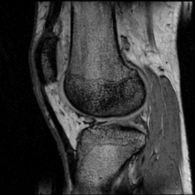
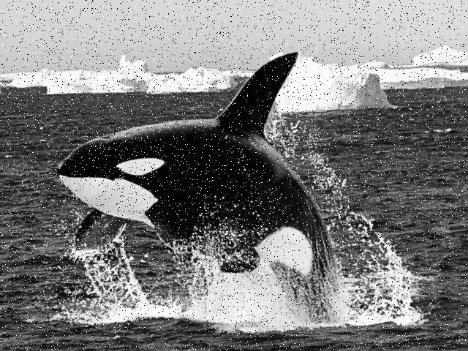
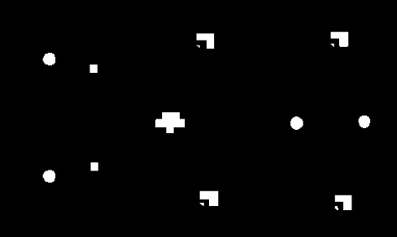
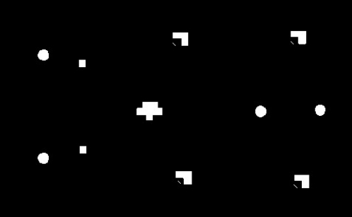

**!!! Dutch assignment documentation provided by school !!!**

Practicumhandleiding

Image Processing & Computer Vision

|**Naam**|Wouter de Bruijn|
| :- | :- |
|**Lab 1**|Finished 2022-04-28|
|**Lab2**|Finished|
|**Lab3**|Finished|
|**Lab4**|Finished|
|**Lab5**||

Versie  1920-1

# **IMVIS lab 1: Introductie software** 
## **Inleiding** 
Tijdens een aantal practica zullen algoritmes met betrekking tot Computer Vision en Image Processing geïmplementeerd worden in software. Het gebruikte platform is Windows en Visual Studio 2019 met C++. Tijdens het 1e lab wordt ingegaan op de structuur van de gebruikte software. Verder worden een aantal eenvoudige beeldbewerkingen uitgeprobeerd, aangepast of geschreven. 
**

## **De software** 
Het practicum heeft als basis de Open Source Computer Vision Library OpenCV. 

Zie ’introduction’ op <https://docs.opencv.org/4.5.5/>. 
Als je informatie over OpenCV zoekt, ga dan eerst naar deze link en gebruik het zoekveld rechtsboven.

We maken maar beperkt gebruik van OpenCV. We gebruiken OpenCV om beelden in te lezen en weer te geven, maar vooral om een beeldarray beschikbaar te stellen waarop je je bewerkingen doet.

*Het is niet de bedoeling dat je voor de gevraagde algoritmes de kant en klare OpenCV functies gebruikt. We willen je juist leren hoe beeldbewerking **“onder de motorkap”** werkt.*

Er wordt gewerkt met C++, maar dit practicum is niet opgezet met als doelstelling dat het een OOPR vak is. Er wordt je gevraagd een aantal klassen te maken zodat de code herbruikbaar is (als in Lab 4). 

*Uit het oude practicum:*

De software is opgebouwd als een verzameling objecten die onderling gekoppeld kunnen worden om een beeldbewerking of beeldherkenning te realiseren. Een aantal classes zijn al beschikbaar. Deze worden kort beschreven. Eerst een aantal conventies die de source overzichtelijker maakt: 

- elke class is geschreven in een eigen file (.cpp) met een bijbehorend headerfile (.h); 
- namen van classes zijn zelfstandige naamwoorden en beginnen met een hoofdletter; 
- namen van objecten (instanties dus) starten met een hoofdletter; 
- attributen van een class starten met een hoofdletter; 
- operaties in een class starten met een kleine letter; 
- integers worden volgen C99-formaat gedeclareerd (bijv uint8\_t ) 
- de main-functie maakt objecten dynamisch aan, koppelt ze door doorgifte van pointers  en zet ze aan het werk. 

De beschikbare classes: 
1. **Histogram**		Doel: 	Histogram van afbeeldingen genereren.  

1. **Mirror** 			Doel:	Voorbeeld van een beeldbewerking,
   ` 				`spiegelt het beeld langs de verticale as.
##
## **Overige modules:  H-SE-IMVIS.cpp**
Doel: Dit is geen class maar bevat *main* met de noodzakelijk functies om alle objecten te instantiëren en te koppelen (stap 1), in de juiste volgorde te laten werken (stap 2) en vervolgens bepaalde resultaten af te beelden (stap 3). 

# **Week 1**

## **Testen van de software** 
- Zorg dat in Windows de software (Visual Studio en OpenCV) is geïnstalleerd volgens de installatiehandleiding.
- Download van BlackBoard het Visual Studio project ***H-NSE-IMVIS.zip*** en pak deze uit in de map waar Visual Studio zijn bestanden opslaat.
- Download alle plaatjes van BlackBoard en plaats deze in een map IMVIS.
- Start Visual Studio en open het project **H-NSE-IMVIS**
- Open het bestand **H-NSE-IMVIS.cpp**
- Pas hierin de paden van de plaatjes aan.
- Start debuggen met F5 of klik op het groene driehoekje. Dit venster verschijnt:

H-NSE-IMVIS   -   Maak een keuze (geef nummer + druk Enter)

-1: Demo met camera en histogram

` `1: Lab 1 Opdracht 1a - Spiegelen

` `2: Lab 1 Opdracht 1b - Inverteren

` `3: Lab 1 Opdracht 2  - Contrast aanpassen

` `4: Lab 2 Opdracht 2  - Affien: Zoomen

` `5: Lab 2 Opdracht 2b - Affien: Roteren

` `6: Lab 2 Opdracht 3  - Mysterieuze affiene transformatie - LET OP! : TOETSVRAGEN!

` `7: Lab 3 Opdracht 1  - Hoogdoorlaat filter

` `8: Lab 3 Opdracht 2a - Laagdoorlaat filter

` `9: Lab 3 Opdracht 2b - Mediaan filter

10: Lab 4 Opdracht 3  - Mier(en)

11: Lab 5 Opdracht 1  - Gaten tellen1

12: Lab 5 Opdracht 2  - Gaten tellen2 - verbeterd

Maak een keuze (0 = stoppen):
 

Probeer opties -1 en 1 uit en bestudeer de code. 
De rest van de opties doet nog niks, die ga je zelf invullen gedurende het practicum.

***Dat zijn de practicumopdrachten die je laat aftekenen.***

- **OPDRACHT 1a:** Wijzig de software zodanig dat langs de horizontale as wordt gespiegeld.  

Test dit uit. 

- **OPDRACHT 1b:** Maak een nieuwe class die het beeld inverteert (negatief beeld, wit <-> zwart). **TIP:** gebruik Mirror.h en Mirror.cpp als uitgangspunt door deze te kopiëren naar Invert.h en Invert.cpp

## **Opdracht 2 - Verdeling en contrast** 

- **OPDRACHT**: Beeld het plaatje af en toon een histogram van het plaatje. 

Bepaal het probleem van de afbeelding *donker.pgm* op basis van de distributie.
Hulpmiddel: met de slider in het Histogram kun je per grijswaarde zien hoeveel pixels deze grijswaarde hebben.

- **OPDRACHT**: Verbeter het contrast door een nieuwe class te maken (net als bij de vorige opdracht). Deze class doet twee zaken: 
1. minimale waarde bepalen 
1. deze waarde van alle pixelswaardes aftrekken 
1. alle pixelwaardes versterken met een slimme waarde 
# **IMVIS Lab 2: Affiene transformaties** 

## **Inleiding** 
In dit practicum ga je een aantal affiene transformaties uitvoeren (translatie, rotatie, schaling en shear). 

## **Opdracht 1 - Conversie van afbeeldingsformaten** 
Dit stukje is nog een erfenis uit het oude practicum dat alleen bestanden uit de NetPBM familie kon lezen en schrijven. Lees deze pagina: <https://en.wikipedia.org/wiki/Netpbm> 

Nu we OpenCV gebruiken is dat niet meer nodig, OpenCV converteert automatisch. Aangezien bestandsformaten ook in het hoorcollege worden behandeld, toch even een praktisch deel:

- Download en installeer het programma **IrfanView**: <https://www.irfanview.com/main_download_engl.htm>
- Open met IrfanView het plaatje *Rijswijk.jpg*
- Bekijk met View -> Hexview (of **F3**) de header van het bestand.

**Vraag 1**: Wat leren we van de header van dit bestand? Verklaar!

**\_\_\_\_\_\_\_\_\_\_\_\_\_\_\_\_\_\_\_\_\_\_\_\_\_\_\_\_\_\_\_\_\_\_\_\_\_\_\_\_\_\_\_\_\_\_\_\_\_\_\_\_\_\_\_\_\_\_\_\_\_\_\_\_\_\_\_\_\_\_\_\_\_\_\_\_**

- Sla het bestand op als *Rijswijk.**ppm***   (Portable PixelMap)
  Zet in het “Save Picture As..” venster “Show options dialog” aan.
- Bekijk met View -> Hexview (of **F3**) de header van het bestand.

**Vraag 2**: Wat zien we nu in de header van dit bestand? Verklaar!

**\_\_\_\_\_\_\_\_\_\_\_\_\_\_\_\_\_\_\_\_\_\_\_\_\_\_\_\_\_\_\_\_\_\_\_\_\_\_\_\_\_\_\_\_\_\_\_\_\_\_\_\_\_\_\_\_\_\_\_\_\_\_\_\_\_\_\_\_\_\_\_\_\_\_\_\_**

**Vraag 3:** Druk **Shift+H** voor een histogram en vink alle opties aan. Wat is de betekenis van de verschillende curves?

**\_\_\_\_\_\_\_\_\_\_\_\_\_\_\_\_\_\_\_\_\_\_\_\_\_\_\_\_\_\_\_\_\_\_\_\_\_\_\_\_\_\_\_\_\_\_\_\_\_\_\_\_\_\_\_\_\_\_\_\_\_\_\_\_\_\_\_\_\_\_\_\_\_\_\_\_**

- Vanuit IrfanView: Druk **Ctrl+R** om het bestand te resizen naar 640x480 
  (tip: gebruik ook **Shift+V** (Method 2) om te croppen). 
- Sla het bestand op als *Rijswijk.**pgm***   (Portable GrayMap)
  Zet in het “Save Picture As..” venster “Show options dialog” aan.
- Bekijk met View -> Hexview (of **F3**) de header van het bestand.

**Vraag 4**: Wat zien we nu in de header van dit bestand? Verklaar!

**\_\_\_\_\_\_\_\_\_\_\_\_\_\_\_\_\_\_\_\_\_\_\_\_\_\_\_\_\_\_\_\_\_\_\_\_\_\_\_\_\_\_\_\_\_\_\_\_\_\_\_\_\_\_\_\_\_\_\_\_\_\_\_\_\_\_\_\_\_\_\_\_\_\_\_\_**

` 	`1-2 
## **Opdracht 2 - Bouwen van een "zoom"-class** 
- Maak een nieuwe class Zoom die voldoet aan de volgende eisen: 
  - vergroting moet meegegeven worden als parameter 
  - bij vergroting moet kunnen worden opgegeven waar op wordt ingezoomd (coördinaten) 
  - bij verkleining moet het kleinere beeld in het midden van een 640x480 worden afgebeeld met daaromheen een witte rand.
  - Gebruik als afbeelding *Rijswijk.pgm* (resultaat uit de vorige opgave). 
**

**Ter voorbereiding:** 

**Vraag 3:** Hoe ziet het prototype van de process-operator er uit (dus de exacte parameters voor deze situatie)** 

- Verander de code zodat zoomfactor en coördinaten gevraagd worden. 

## **(Optioneel) Opdracht 3 - Verdeling en contrast** 

● Implementeer de volgende bewerking in software en test deze uit op een afbeelding. 

` `

**Ter voorbereiding:** 

**Vraag 4:** Schrijf de vergelijkingen uit.** 

# **IMVIS lab 3: Image-filters** 
** 

**Inleiding** 

D.m.v. convolutie zijn eenvoudig lineaire image-filters te realiseren. 

## **Opdracht 1 - Verbeteren**  
Gegeven een afbeelding (rontgenfoto) van een kniegewricht. De afbeelding is van Blackboard te downloaden (joint.jpg). 

Verbeter de details op de foto door het resultaat van een hoogdoorlaatfilter op te tellen bij de oorspronkelijke afbeelding. *LET OP: Alleen de onderstaande kernel toepassen is niet voldoende*

|-1|-1|-1|
| :- | :- | :- |
|-1|` `9|-1|
|-1|-1|-1|
kernel HD:      

Tips:  	- Zorg dat er genormeerd wordt! 

\- de **optelling** met het oorspronkelijke beeld kan op kernelniveau al gebeuren zodat met

`  `één kernel beide bewerkingen worden uitgevoerd. 

## **Opdracht 2 - Filtering van ruis** 

● Gegeven onderstaande afbeelding met salt & pepper ruis. De afbeelding is te downloaden van Blackboard (whalesp.jpg). 

` `Opdracht 2a

- Verwijder de ruis met een 3x3 smoothing filter. 

` `Opdracht 2b

- Verwijder de ruis met een 3x3 mediaan filter. Dit gaat per pixel als volgt: 
  - alle 9 pixels langslopen (middelste pixel + 8 buren) en in array plaatsen
  - sorteer de pixels in het array op waarde (laag naar hoog)
  - de middelste waarde uit de rij wordt de nieuwe waarde in de nieuwe afbeelding

|7|3|2|
| :-: | :-: | :-: |
|1|4|2|
|4|7|1|
bijv:      

wordt: 1 1 2 2 **3** 4 4 7 7  -> nieuwe **middelste** waarde is 3 

**IMVIS lab 4: Binaire operaties** 
**

**Inleiding** 

D.m.v. van logische functies (AND, OR, XOR) en morphologische operaties (dilate, erode, open, close) zijn bewerkingen uit te voeren op binaire (ZW) afbeeldingen. 

**Zoek de mier!**  

Gegeven twee afbeeldingen van een mierenkolonie. In de 2e afbeelding is één mier verdwenen. 

De tijd tussen beide opnames is zo klein dat de overige mieren nog nauwelijks bewogen hebben. 

 

We gaan de computer laten uitzoeken welke mier verdwenen is. De afbeeldingen zijn vanaf Blackboard te downloaden (ze zijn al geconverteerd naar grijstint 8 bits PGM-afbeelding van 640x480).  

Om binaire operaties toe te passen zullen de beelden eerst omgezet moeten worden naar zwart wit (binair). 

## **Opdracht 1** 
Om snel met de afbeeldingen wat bewerkingen uit te proberen gaan we ImageJ gebruiken. ImageJ is een beeldbewerkingstool (in Java geschreven), waarmee d.m.v. een GUI verschillende beeldbewerkingen eenvoudig zijn uit te voeren. 

- Download ImageJ van Blackboard (of van de website van ImageJ). 
- Pak het uit (zip?)
- Start vanuit de uitgepakte map ImageJ op.
- Speel 15min met de software om thuis te geraken in de GUI 

*Interessante opties:* 

- *Inladen en opslaan van files: spreekt voor zich* 
- *Beeld converteren naar zwart wit met instelbare threshold: **Image->Adjust->Threshold*** 
- *Morfologische functies zijn te vinden onder **Process->Binary*** 
- *Logische bewerkingen met twee beelden is te vinden onder **Process->Image Calculator*** 

` 	`1-2 
## **Opdracht 2** 
Open en converteer in ImageJ *ants1.pgm* en *ants2.pgm* naar Z/W-formaat (binair). Gebruik dezelfde drempelwaarde voor beide. (je mag deze waarde vinden door op het oog uit te proberen). 

Laat beide resultaten geopend staan. 

Gekozen: drempelwaarde: 120\

Probeer vervolgens met binaire bewerkingen de verdwenen mier te vinden. 

Welke bewerkingen moeten achtereenvolgens worden uitgevoerd? 

\_\_\_\_\_\_\_\_\_\_\_\_\_\_\_\_\_\_\_\_\_\_\_\_\_\_\_\_\_\_\_\_\_\_\_\_\_\_\_\_\_\_\_\_\_\_\_\_\_\_\_\_\_\_\_\_\_\_\_\_\_\_\_\_\_\_\_\_\_\_\_\_\_\_\_\_ 

\_\_\_\_\_\_\_\_\_\_\_\_\_\_\_\_\_\_\_\_\_\_\_\_\_\_\_\_\_\_\_\_\_\_\_\_\_\_\_\_\_\_\_\_\_\_\_\_\_\_\_\_\_\_\_\_\_\_\_\_\_\_\_\_\_\_\_\_\_\_\_\_\_\_\_\_ 
**

## **Opdracht 3** 
Bouw de beeldbewerkingen in H-NSE-IMVIS 

Zorg dat de bewerkingen in een aparte klasse (of klassen) komen zodat je deze bewerkingen meerdere keren op een plaatje uit kunt voeren zonder code te copy-pasten.

Het gaat om de volgende functionaliteiten:

- Threshold
- Xor
- Dilate
- Erode
- And, Or (optioneel, kijk wat je nodig hebt)

Zoals gezegd: je moet zelf kijken in welke volgorde en hoe vaak je een bewerking moet uitvoeren om tot het gewenste resultaat te komen

Zo stond de opdracht in het oude practicum:

Bouw hiervoor de volgende ImageProcessor classes: 

**class Threshold** 

**Threshold(TImageBuffer \*in, TimageBuffer \*out);**

**process (uint8\_t threshold);**  //converts grayscale to black and white 

**class TBinaryProcessor: public TImageProcessor TBinaryProcessor(TImageBuffer \*in, TimageBuffer \*out);** 

**process XOR(void);** //XOR’s bitwise two images and puts the result in the second image process 

**dilate(void);**  //creates in Image2 a dilution version of Image1 process 

**erode(void);** //creates in Image2 a eroded version of Image1
\*

# **IMVIS Lab 5: Gaten tellen** 
** 
## **Opdracht 1** 
- Download van BB de afbeelding chassis1.pgm 
- Maak en test een algoritme dat de gaten telt in het chassis. 

TIP: bekijk de sheets van HC5. 

` ` 
**

## **Opdracht 2** 
- Download van BB chassis2.pgm 
- Probeer het algoritme opnieuw. Wat gaat er mis? 
- Bedenk en implementeer een oplossing voor het probleem. 

` `

` 	`9 
